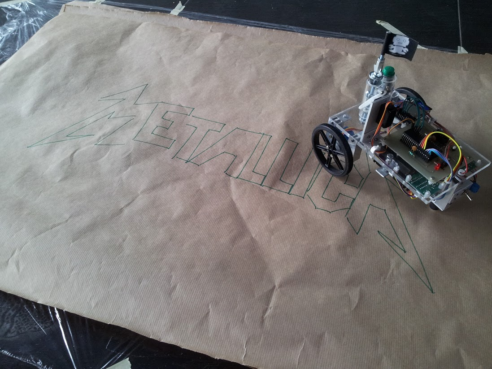

# roboday
Driving robot, leaving pen traces to create pictures - AVR. Made for Poznan University of Technology's Roboday.

Microcontroller used: ATmega32. Robot draws images made of single lines, stored on SD card in our custom file format.
See source code for more details.

[Youtube movie showing process of creating it, and basic functionality](https://www.youtube.com/watch?v=uvd2bjJfSck)

